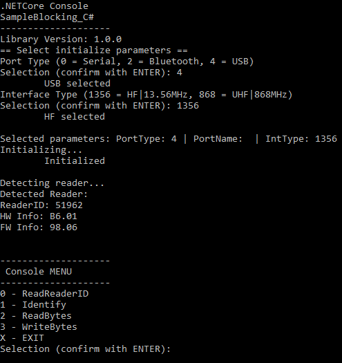

# .NET DOC sample code for RFID transponders
This sample code is for handling both HF and UHF transponders on devices running UNIX OS using a Micro-Sensys RFID reader

> For details on DOC communication check [Useful Links](#Useful-Links) 

## Requirements
* IDE (for example Visual Studio)
* Micro-Sensys RFID reader (either Bluetooth or module)
* Any HF or UHF transponder

## Implementation
This code shows how to use **iIDReaderLibrary.DocInterfaceControl** class to read/write transponders. 
For demo purposes, a .NET Core console sample code is provided. There are different projects available that show all the different functions provided.
Code used for these projects is written in C# or VisualBasic.

> Class information is available under API documentation. See [Useful Links](#Useful-Links)

## Steps
Import this project into your IDE, choose a project and launch it. First in the console application you can select the communication port name for the RFID reader (for example */dev/ttyUSB0*). Then a sort of *menu* is shown to select the function to call

 1. Select the device parameters to use for *Initialize* (communication port type and name, and interface type). Once the initialization process finishes, the result will be shown including the Reader ID number.
 2. Use the menu options to perform the functions

### Special Hints for Linux
* Device has to be configured in USB VCP mode (ask microsensys for HowTo)
	* To get VCP port name use:	
		> dmesg | grep FTDI
* To be able to communicate with RFID reader, the user must be part of the group "dialout".
	* To add the user to the group use:
		> sudo gpasswd --add [username] dialout

## Useful Links
* [NuGet Package page](https://www.nuget.org/packages/Microsensys.iIDReaderLibrary.DocInterfaceControl/)
* [API documentation](https://www.microsensys.de/downloads/DevSamples/Libraries/UNIX/)
* Check what is possible using our iID®DEMOsoft for PC! Download it using [this link](https://www.microsensys.de/downloads/CDContent/Install/iID%c2%ae%20DEMOsoft.zip)
* GitHub *documentation* repository: [Micro-Sensys/documentation](https://github.com/Micro-Sensys/documentation)
	* [communication-modes/doc](https://github.com/Micro-Sensys/documentation/tree/master/communication-modes/doc)

## Contact

* For coding questions or questions about this sample code, you can use [support@microsensys.de](mailto:support@microsensys.de)
* For general questions about the company or our devices, you can contact us using [info@microsensys.de](mailto:info@microsensys.de)

## Authors

* **Victor Garcia** - *Initial work* - [MICS-VGarcia](https://github.com/MICS-VGarcia/)
